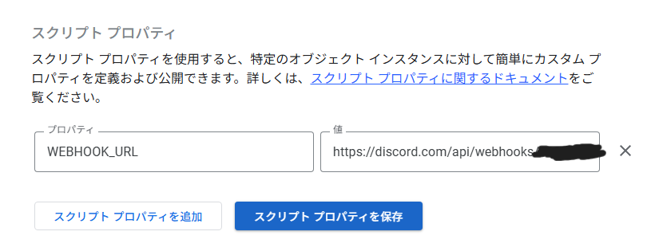

# CIT新出席システムリマインダー（GAS + Discord Webhook）

このプロジェクトは,**教室掲示のQRコードから取得できる講義出席リンク**を,講義開始30分前に**Discordへ自動で通知**するリマインダーです. Google Apps Script（GAS）と Discord Webhook を組み合わせて動作します.新システム以降に伴う出席失念の防止,**カメラを搭載しないデバイスでの出席登録補助**を目的としています.

##  特徴

- 5分おきに実行され,開講30分前に対応する講義があれば Discord に通知
- 曜日・開始時間・教室IDを Google スプレッドシートから読み込み
- Webhook URL をプロパティストで管理しコードの改変不要
- 通知は Discord の「埋め込み」メッセージ形式で見やすく装飾

---

##  ファイル構成

| ファイル名              | 内容                                               |
|------------------------|----------------------------------------------------|
| `assets`            | readme用のサンプルイメージを格納したディレクトリ                  |
| `AttendanceReminder.gs` | GAS本体スクリプト                                  |
| `README.md`            | この説明書                                         |

---

##  初期設定手順（GAS）

### 1. Googleスプレッドシートを用意
[テンプレート](https://docs.google.com/spreadsheets/d/1HNuGbcuBiJD9RuD3_1rF5INeqLMUUQpONuWMpBUD2gg/template/preview)からスプレッドシートをダウンロードし以下のような形式のシートを `Classes` という名前で作成します.

| 曜日 | 時限 | 講義名      | 教室番号 | 開始時刻 |
|------|------|-------------|----------|----------|
| 月   | 1    | インターネット | 621      | 09:00    |
| 火   | 3    | データ構造     | 622      | 13:00    |

- 曜日は **漢字1文字（例: 月, 火）**
- 開始時刻は `HH:MM` 形式（例: `09:00`）

### 2. GASスクリプトを貼り付け
- スプレッドシート上部のメニューから,拡張機能 > Apps Script を開き,`AttendanceReminder.gs` の内容を貼り付けて保存します

### 3. Webhook URL を登録
Apps Script エディタ画面の右上にある 歯車マーク（プロジェクトの設定） をクリックし,スクリプトのプロパティ > **スクリプトのプロパティの追加**を選択.
下記のように設定し保存します.(＊Discordウェブフックの取得については各自検索してください)
- プロパティ: WEBHOOK_URL
- 値: あなたの Discord Webhook の URL（例：https://discord.com/api/webhooks/xxxxx/yyyyy）

### 4. トリガーの設定
画面左側の歯車マークから以下のようにトリガーを設定します:

- 実行する関数の選択: `autoReminderFromSheet`
- 実行するデプロイを選択: HEAD
- イベントのソースを選択: **時間主導型**
- 時間ベースのトリガーのタイプを選択: **分ベースのタイマー**
- 時間の間隔を選択（分）：**5分おき**

---

##  動作確認

スプレッドシートにテスト用の講義を追加し,対応する時間にリマインダーがDiscordに届くか確認してみてください.

---

##  複数人での共有利用

- このツールは **個別のWebhook** を使用するため,スクリプトをコピーして使うことを推奨します.
- スプレッドシートのみ共有する場合でも,各自が プロパティからwebhookを設定することで利用可能です.

---

##  補足：通知メッセージの例

Discordに以下のようなリマインダーが表示されます:

---

##  セキュリティメモ

- Webhook URLはスクリプト内に保存せず,GASの「スクリプトプロパティ」に安全に保存されます.
- スプレッドシートは個人用,または信頼できる相手と共有しましょう.

---

##  ライセンスと使用上の注意

- このプロジェクトは自由に改変・再配布可能ですが,**学内用途向け**です.
- GASやDiscordの仕様変更により,予告なく動作しなくなる可能性があります.

